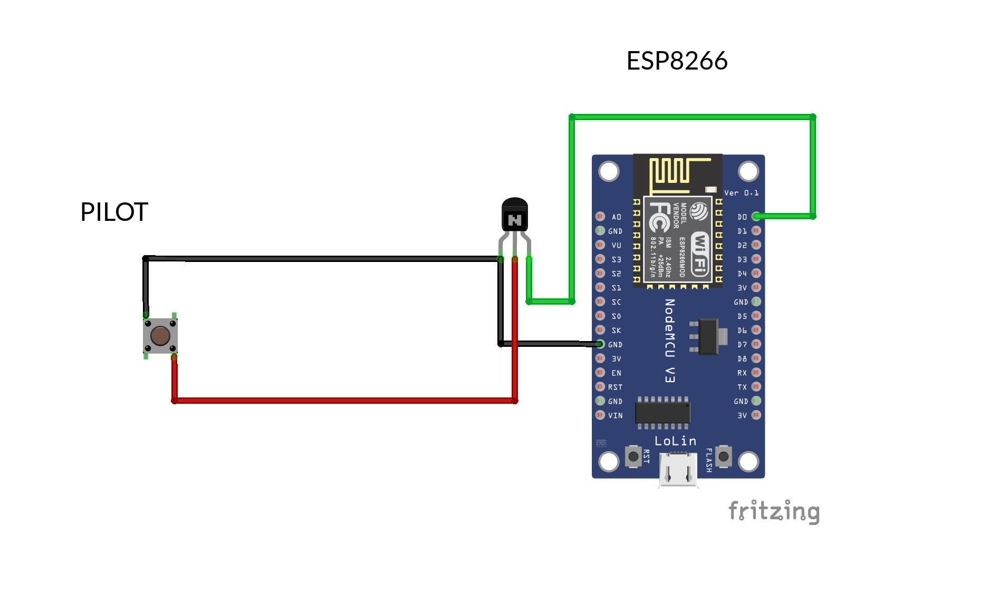
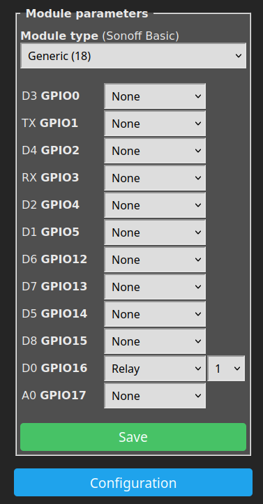
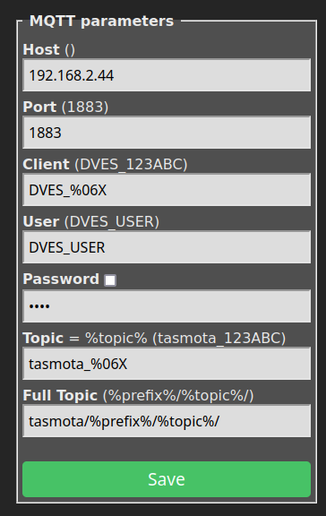
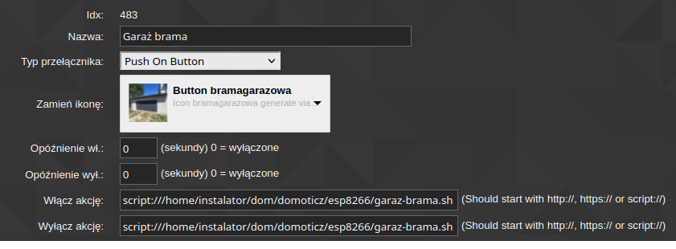

## Schemat
### UWAGA! NALEŻY SPRAWDZIĆ (MULTIMETREM) GDZIE ZNAJDUJE SIĘ + I - PRZYCISKU!
### UWAGA! NIE NALEŻY PODŁĄCZAĆ + PRZYCISKU BEZPOŚREDNIO DO ESP8266!
`+` oznaczony jest przewodem czerwonym, `vcc`  
`-` oznaczony jest przewodem czarnym, `gnd`  

### BOM
- ESP8266 (NodeMCU / Wemos D1 Mini / inny)
- Tranzystor NPN (na schemacie poniżej narysowany jest tranzystor o wyprowadzeniach ECB - emiter-kolektor-baza)

## Wgrywanie kodu i konfiguracja
- Instalacja Tasmota: https://tasmota.github.io/docs/Getting-Started/#flashing  
- Ustawiamy `Configuration` -> `Configure Module` tak jak na obrazku i klikamy `Save`  

- Ustawiamy `Configuration` -> `Configure MQTT` tak jak na obrazku (**zamieniając `Host` na adres naszego brokera MQTT**) zapisując wartość w nawiasie obok `%topic%` - przyda się później (w przykładzie jest to `tasmota_123ABC`)  i klikamy `Save`  

## Tworzenie skrytpów na serwerze 
- Kopiujemy skrypt `garaz-brama.sh` na serwer
- Edytujemy skrypt, zamieniając `tasmota_123ABC` na wartość wyświetlającą się w Tasmota
- Ustawiamy w Domoticz / HomeAssistant / innym systemie automatyki uruchamianie tego skryptu przy kliknięciu przycisku otwierania bramy - przykład dla Domoticza poniżej

